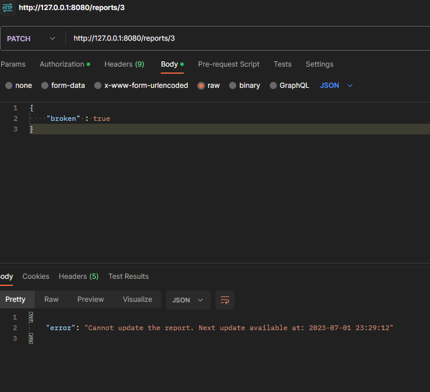
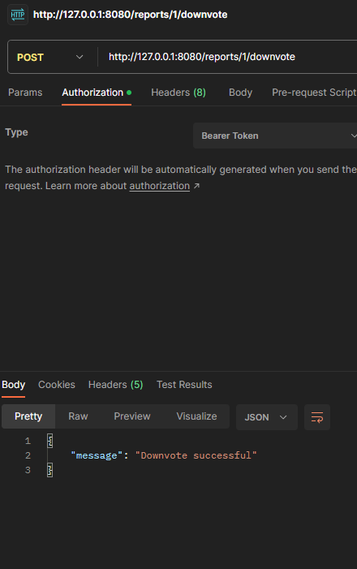
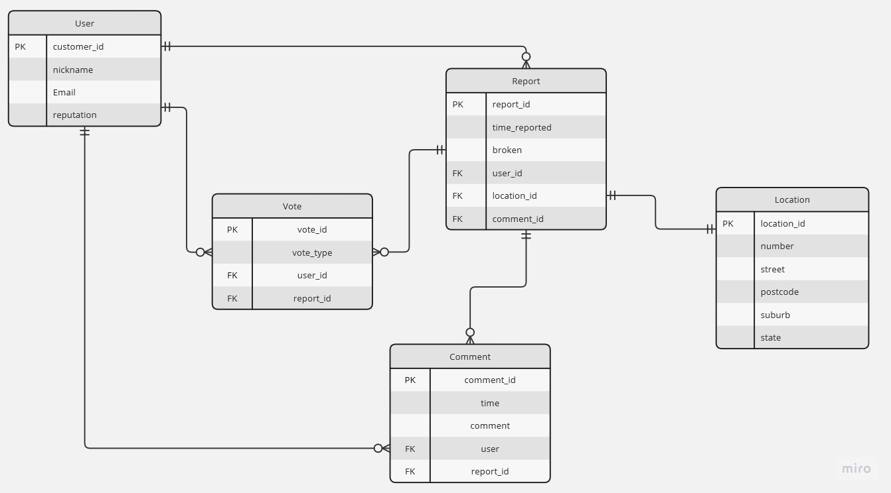

# T2A2 Mcbroken
***

## Installation Instructions


***

## R1 + R2 Identification of the problem you are trying to solve by building this particular app and why is it a problem that needs solving?

The problem that I am trying to solve with this simple API is to create a way that peolpe are able to communicate when an ice cream machine is broken at Mcdonalds.  This is a problem that needs solving because the problem of ice cream machines being broken at a Mcdonalds has been so prevalent that it has become a running joke that they never work. By creating this community based reporting system it would be something that can 

The problem that is trying to be solved with the creation of the app that uses commnunity reports on broken Mcdonald's ice cream machines is the annoyance and frustration that customers have when they find out the ice cream machine is broken. This problem has become so prevalent that it has become a running joke that they never work.

Reasons for this to be solved;
1. Customer Resolution: Customers come to Mcdonald's wanting soft serves, and Mcflurries however because of the above issue it's become a running joke that they are always up in the air whether they are able to get them or not. This causes dissatisfaction and disappointment among customers, though I am making this for community in mind with comments and upvotes rather than Mcdonald's itself, though it would be something Mcdonalds could add to their app.
2. Time and Effort: Following from the previous point, people knowing in advance whether or not the machine is broken would save them time, money and effort. With the app users would be able to check the status of nearby Mcdonald's locations and decide which one to visit making sure they go with ones that have the most recent reports of operational.
3. Machine Fixing: Although I would want this to be for community in mind, if Mcdonald's did do something along these lines it would help with reporting problems with machines and hopefully fixing them. A future solution could also include data analysis for machines breaking down and when for maintenance and reducing machine downtime as well as making it more efficient for Mcdonald's.
4. Accountability: With a global brand such as Mcdonald's it may be quite difficult to maintain and check every issue their machines have, however with the app it allows the users around the world to have control and hold Mcdonald's accountable for this problem in particular.

***

## R3 Why have you chosen this database system. What are the drawbacks compared to others?

For this database system I have chosen to use Postgres. The reason for this is because it is a relation database, which is suited for an app such as this one that requires data to have structured relationships such as broker ice cream machines and their infomration that we will be using such as location, user report, time, etc. This can be done through the ability to define tables, establish the relationships between them and create queries that are efficient using PostgreSQL. Data integrity is also a key point for this as it ensures that data stored in the database is consistent and accurate which is important for making sure that the information on broken machine reports is correct and up to date with any changes being constantly made and upvoted by users.

In future if this was to be developed further for other purposes or even as the Mcdonald's brand as a whole as it is a global brand with over 38.000 locations across the world Postgres is known for its scaling ability to handle a large dataset and process queries efficiently as long as it's setup correctly. As the app grows over time and users, data, and possibly other information it will be able to handle the data and ensure a smooth performance for the API. This particularly will be very important for handling community reports which can come in and be updated quickly for real time updates on machine status. Thinking of the future as well since it is a well known and used database system the support system that it has for features, extensions and communities are quite large which means that there are a lot of ways the app could grow and be used. An example of this is the ability to provide geospatial data which can be used for mapping and locating Mcdonald's restaurants with working machines.

PLACEHOLDER FOR IMAGE OF DATABASE 

[What is PSQL -AWS](https://aws.amazon.com/rds/postgresql/what-is-postgresql/)

[Why PSQL](https://fulcrum.rocks/blog/why-use-postgresql-database)

Coder Academy Slides and Notes

***

## R4 Identify and discuss the key functionalities and benefits of an ORM

An ORM or Object Relational Mapping is a technique or tool in in software development that helps developers interact with databases. When interacting with a database using languages (OOP), CRUD operations are completed to do this, normally this requires the use of SQL, this is made simpler by using an ORM. It is similar to a layer in that it translates the data between what is used in the databases and the language used in the OOP implementation. In general they are used as an abstraction technique to increase productivity by removing need for boilerplate code and avoid use of awkward techniques to bypass any laguange parameters.

An example of this is below where code is made shorter and simpler using an ORM tool:

```
# From freeCodeCamp
SELECT id, name, email, country, phone_number FROM users WHERE id = 20
# Changed to below
users.GetById(20)
```

By doing this and mapping the databases to object classes in the OOP language a developer can work with something that they are familiar with such as objects, inheritance and encapsulation, this would  make the code simpler and increase productivity as it's something they already know it is easier to maintain and create. ORM's also tend to have other similarities to OOPs such as inheritance and encapsulation. Furthermore because of ORM's and their layer of abstraction provided it allows a developer to use different database systems without making significant changes to the code to be usable. 

In the Mcbroken app I will be using the tool SQLAlchemy which has the structures available to be seen below.

TABLE IN PSQL:

SQLAlchemy MODEL:

GET REQUEST:


[What is an ORM](https://www.prisma.io/dataguide/types/relational/what-is-an-orm)

[What is an ORM freeCodeCamp](https://www.freecodecamp.org/news/what-is-an-orm-the-meaning-of-object-relational-mapping-database-tools/)

Coder Academy Notes and Slides

***
## R5 Document all endpoints for your API

### Endpoints for auth_bp

In auth_bp the endpoints have a default url prefix of users then additional add ons to the endpoints


1. `@auth_bp.route('/')`

* **Method**: GET
* **Identitifier**: None
* **Authentication**: @jwt_required
* **Token**: JWT Access bearer Token Generated when login is successful.
* **Description**: Allows admins to view all users, only admins as it helps with finding users and checking comments of users.
  


2. `@auth_bp.route('/<string:username>')`

* **Method**: GET
* **Identitifier**: username
* **Authentication**: @jwt_required
* **Token**: JWT Access bearer Token Generated when login is successful.
* **Description**: Allows users and admins to specifically go to a user profile and check comments.
* 


3. `@auth_bp.route('/register', methods=['POST']) # Register for account`

* **Method**: POST
* **Identitifier**: None
* **Authentication**: Password Hashed with the use of Bcrypt
* **Token**: None
* **Description**: Adds new user to the database if username or email is not already in use.
* 


4. `@auth_bp.route('/login', methods=['POST'])`

* **Method**: POST
* **Identitifier**: username
* **Authentication**: username and Password
* **Token**: Generated with JWT
* **Description**: Allows users within database (registered) to login and generate a JWT token to access other routes. Username or password being incorrect will lead to an error. An incorrect key may be sent as well however as long as user and password is correct it will let the user login.


### Endpoints for report_bp

1. `@reports_bp.route('/')`

* **Method**: GET
* **Identitifier**: none
* **Authentication**: None
* **Token**: None
* **Description**: Allows users to view all current reports on Mcdonald's Ice Cream Machine locations that are registered in the database and their current status
* 


2. `@reports_bp.route('/<string:suburb>')`

* **Method**: GET
* **Identitifier**: suburb
* **Authentication**: None
* **Token**: None
* **Description**: Filters the results of the request by suburb so that it only shows the Mcdonald's in a specific suburb.
* 


3. `@reports_bp.route('/broken')`

* **Method**: GET
* **Identitifier**: broken
* **Authentication**: None
* **Token**: None
* **Description**: Filters the results of the request by only machines that are broken
* 


4. `@reports_bp.route('/working')`

* **Method**: GET
* **Identitifier**: broken
* **Authentication**: None
* **Token**: None
* **Description**: Filters the results of the request by only machines that are working
  


5. `@reports_bp.route('/report', methods=['POST'])`

* **Method**: POST
* **Identitifier**: user_id
* **Authentication**: @jwt_required
* **Token**: JWT Access bearer Token Generated when login is successful.
* **Description**: Allows users to post new locations of Mcdonald's if it is not already in the database and if it is will tell user to either update or search using suburb
  


6. `@reports_bp.route('/<int:report_id>', methods=['PUT', 'PATCH'])`

* **Method**: PUT / PATCH
* **Identitifier**: user_id
* **Authentication**: @jwt_required
* **Token**: JWT Access bearer Token Generated when login is successful.
* **Description**: Allows user's to update current status of Ice cream machines every 15 minutes and also resets upvotes and downvotes of the report once updated. Also advising user to use a boolean if one is not used.





7. `@reports_bp.route('/<int:report_id>/upvote', methods=['POST'])`

* **Method**: POST
* **Identitifier**: user_id
* **Authentication**: @jwt_required
* **Token**: JWT Access bearer Token Generated when login is successful.
* **Description**: Allows users to upvote a report if they wish to show it is a good report.


  
8. `@reports_bp.route('/<int:report_id>/downvote', methods=['POST'])`

* **Method**: POST
* **Identitifier**: user_id
* **Authentication**: @jwt_required
* **Token**: JWT Access bearer Token Generated when login is successful.
* **Description**: Allows users to downvote a report if they wish to show it is a good report.




9. `@reports_bp.route('/<int:report_id>/comment', methods=['POST'])`

* **Method**: POST
* **Identitifier**: user_id
* **Authentication**: @jwt_required
* **Token**: JWT Access bearer Token Generated when login is successful.
* **Description**: Allows users to leave comments on reports, it also ensures that comments are not blank when posted.


1.  `@reports_bp.route('/<int:report_id>/comment/<int:comment_id>', methods=['PUT', 'PATCH'])`

* **Method**: PUT / PATCH
* **Identitifier**: user_id
* **Authentication**: @jwt_required
* **Token**: JWT Access bearer Token Generated when login is successful.
* **Description**: Allows users to edit their own comments. Admins are also able to edit other people's comments. Error if comment is empty. 


11.  `@reports_bp.route('/<int:report_id>/comment/<int:comment_id>', methods=['DELETE'])`

* **Method**: DELETE
* **Identitifier**: user_id
* **Authentication**: @jwt_required
* **Token**: JWT Access bearer Token Generated when login is successful.
* **Description**: Allows users to delete their own comments. Admins are also able to delete other people's comments


***

## R6 An ERD for your app



***

## R7 Detail any third party services that your app will use

The there are several third party services that are being used in the application. 

1. **bcrypt**: bcrypt is a password hashing library that allows for passowrds to be securely stored. By using this library when a user is created and a password is stored as well as loaded to check if the password is correct, the actual alphanumeric characters are not shown and are show in an encrpted format.
   
   

2. **Flask**: A web framework that can be used for Python that provides a flexible approach to building web apps. It is the main service that is being used in the application for the web server, it handles things such as routing and response generation. It also handles things such as intergrating other services with Flask using extensions.
   
   1. **Flask-Bcript**: Flask extension that allows the bcrypt library to work with flask and integrates it to simplifying the process of password hashing by using methods designed for Flask apps.

   2. **Flask-JWT-Extended**: Flask extension that adds JWT support to apps that use Flask. Provides more security and authorisation features through generating JWT's which allow users to authenticate through it and access routes that are protected by certain token settings.
   
   3. **flask-marshmallow**: Flask extension that integrates Marshmallow with Flask, allowing for an integration with Flask for converting data types such as objects or records to and from JSON and within APi paylods as well, allowing for the interchange between different systems to be seamless
   
   4. **flask-SQLAlchemy**: Extension that simplifies use of SQLAlchmey in flask, a SQL toolkit and an ORM library within Flask. The interface is simple to implement and use with databases wich allows developers such as myself to define database models, create and perform queries and manage database relationships in a language that is familiar to themselves.
   
3. **Marshmallow**: Marshmallow by itself is a powerful library for serisalisation of objects and deserialisations of them within Python.
   
   1. **marshmallow-sqlalchemy**: Exntension for marshmallow that allows SQLAchemy to be used in conjunction with marshmallow. It does this by automatically generating the schemas from the SQLAlchemy models in the python code.
   
4. **psycopg2 /psycopg2-binary**: Is an adapter that is popularly used with PostgreSQl for Python which allows the created app to connect to an existing PostreSQL datbase and perform operations on the database. It uses an interface similar to python for interacting with the databases in PostgreSQl which allows for queries to be performed and executed in SQL through Python.
   
5. **PyJWT**: A python library that was used for encoding and decoding the JWT that was being created through the JWT extension in flask. It cooperates with it to allow token based authentication within the app when set up.
   
6. **python-dotenv**: Simplifies management of environment variables in applications created in Python. Developers are then able to configure variables in a .env file which can be loaded into the app separately ensuring that sensitive details such as keys, config details, etc are kept separate from the codebase and can also have a .sample version with empty variables to ignore the original in git.
   
   

7. **SQLAlchemy**: It is a SQL toolkil and ORM library for Python, providing a set of tools that have many uses for working with databases and allows for developers to define database models and schemas. 
   In this example below using SQLAlchemy I am able to create a model and schema for the locations table which is used to create a table in the database I have created through PSQL. It also provides the ability to to include certain argments such as the UniqueConstraint which was used to ensure the location combination of data is unique across the database when a location is registered.
   
   


***
## R8 Describe your projects models in terms of the relationships they have with each other

Mcbroken is an API that uses an MVC and is currently represented on the ORM level. The structure of the database is within the models written in Python. There are 5 tables that are being used by Mcbroken. Through the use of SQLAlchemy queries are able to be written in Python to create the table columns, datatypes among other constraints. With Marshmallow as a support it is used to convert the data types from Python and to Python allowing Python and the developer an easier time to manipulate the database.

1. **User Model**: The user model represents user data with relationships to the Report and Comment models and the UserSchema provides a serialisation schema for the User model. When it is called the user model and schema is shown as well as comments as it is a parent when called.
   
   It has the following relationships
   * Zero to many relationship with Reports: A user can have 0 or many reports
   * Zero to many relationship with Comments: A user can have 0 or many comments
   * Zero to many relationship with Votes: A user can have 0 or many votes

  ```python
      # user model and schema 
  from init import db, ma
  from marshmallow import fields

  class User(db.Model):
      __tablename__ = 'users'

      id = db.Column(db.Integer, primary_key=True)
      username = db.Column(db.String(15), nullable=False, unique=True)
      email = db.Column(db.String(255), nullable=False, unique=True)
      password = db.Column(db.String(255), nullable=False)
      is_admin = db.Column(db.Boolean, default=False)

      # Relationships
      reports = db.relationship('Report', back_populates='user')
      comments = db.relationship('Comment', back_populates='user', cascade='all, delete')


  # Returning userSchema is only for admins unless searched username is same as user
  class UserSchema(ma.Schema):

      comments = fields.List(fields.Nested('CommentSchema', exclude=['user']))

      class Meta:
          fields = ('id', 'username', 'email', 'password', 'is_admin', 'comments')

  ```
  When a user is called
  ```JSON
      {
        "comments": [],
        "email": "admin@gmail.com",
        "id": 1,
        "is_admin": true,
        "username": "admin"
    },
  ```

2. **Vote Model**: The vote model represents user votes of either "upvote" or "downvote" and has relationships with User and Report models.
   It has the following relationships
   * One and only one relationship with user: Each vote is allocated to only one user.
   * One and only one relationship with Report: Each vote is allocated to only one report.
   ```python
    # vote model and schema
    from init import db, ma
    from marshmallow import fields

    class Vote(db.Model):
        __tablename__ = 'votes'

        id = db.Column(db.Integer, primary_key=True)
        vote_type = db.Column(db.String(10), nullable=False)  # 'upvote' or 'downvote'

        # Foreign Keys
        user_id = db.Column(db.Integer, db.ForeignKey('users.id', ondelete='CASCADE'))
        report_id = db.Column(db.Integer, db.ForeignKey('reports.id', ondelete='CASCADE'))

        # Relationships
        user = db.relationship('User', backref='votes')

    class VoteSchema(ma.Schema):
        class Meta:
            fields = ('id', 'vote_type')
  ```
  
3. **Report Model**: The report model is responsible for holding reports generated from the user and has relationships with Location, User, Comment and Vote models. The report model when called is the parent of, User, Comment, Vote and Location models.
  It has the following relationships
   * One and only one relationship with user: Each report can have only one user attached at any time
   * Zero to many relationship with vote: Each report can have multiple votes at any time
   * One and only one relationship with location: Each report can have only one location attached at any time

  ```python
      # report schema
    from init import db, ma
    from marshmallow import fields
    from datetime import datetime

    class Report(db.Model):
        __tablename__ = 'reports'

        id = db.Column(db.Integer, primary_key=True)
        time_reported = db.Column(db.DateTime, default=datetime.utcnow) # Time and date posted
        broken = db.Column(db.Boolean, default=False)

        # Foreign Keys
        location_id = db.Column(db.Integer, db.ForeignKey('locations.id'))
        user_id = db.Column(db.Integer, db.ForeignKey('users.id', ondelete='CASCADE'))

        # Do cascade deletes later for links
        # Relationships
        location = db.relationship('Location', back_populates='reports', cascade='all, delete')
        user = db.relationship('User', back_populates='reports', cascade='all, delete')
        comments = db.relationship('Comment', back_populates='report', cascade='all, delete')
        votes = db.relationship('Vote', backref='report')

    # Returning userSchema is only for admins unless searched username is same as user
    class ReportSchema(ma.Schema):

        # Schema Connections
        location = fields.Nested('LocationSchema')
        user = fields.Nested('UserSchema', exclude=['id', 'email', 'password', 'is_admin'])
        comments = fields.List(fields.Nested('CommentSchema'))

        # Formats time to readable string
        time_reported = fields.DateTime(format='%Y-%m-%d %H:%M:%S')

        # add a field for votes
        upvotes = fields.Method("get_upvotes")
        downvotes = fields.Method("get_downvotes")

        # Count the votes
        def get_upvotes(self, obj):
            return len([vote for vote in obj.votes if vote.vote_type == "upvote"])

        def get_downvotes(self, obj):
            return len([vote for vote in obj.votes if vote.vote_type == "downvote"])


        class Meta:
            fields = ('id','broken','location','user','time_reported', 'comments', 'upvotes', 'downvotes')
  ```
  When the report is called
  ```json
      {
        "broken": false,
        "comments": [],
        "downvotes": 0,
        "id": 3,
        "location": {
            "id": 3,
            "number": "G2/620",
            "postcode": "3000",
            "state": "Victoria",
            "street": "Collins Street",
            "suburb": "Melbourne"
        },
        "time_reported": "2023-07-02 00:12:27",
        "upvotes": 1,
        "user": {
            "comments": [],
            "username": "Jane"
        }
    }
  ```

4. **Location Model**: The location model is associated with only reports and represents the location data of a report.
   It has the following relationships
   * One and only one relationship with report: Each location can only be linked to one report at any time.
  

5. **Comment Model**: The vote model represents user comments within a report.
   It has the following relationships
   * Zero to many relationship with User: Each user can have multiple comments
   * Zero to many relationship with Report: Each report can have multiple comments
  

***
## R9 	Discuss the database relations to be implemented in your application

The database used in the Mcbroken_API contains 5 tables, this originally was 3 tables but then location and vote were added separately because they were needed for flexibility of the implementation. A primary key id is stored in each of the tables and it is the number that represents where to find the record in the table via rows.

1. USER TABLE
   
  ```python
      id = db.Column(db.Integer, primary_key=True)
      username = db.Column(db.String(15), nullable=False, unique=True)
      email = db.Column(db.String(255), nullable=False, unique=True)
      password = db.Column(db.String(255), nullable=False)
      is_admin = db.Column(db.Boolean, default=False)
  ```
  Within the application username and password are important fields because they are used for the purposes of authentication so that a user is able to login with @get_jwt_identity, a token is generated and in this token is the id(primary key) which is stored in an encrypted hash. This id is then used throughout the application as a foreign key for the other tables if needed.

  The username and email are unique because they are the key pieces of data that a user will be using to login. The datatypes of username, email and password also strings as they are information used by the user and inputted by them and cannot be null due to this. 

  is_admin is a specific boolean for admin users as they are essentially super users that are able to do and use protocols that a non admin user is unable to.

***

## R10 Describe the way tasks are allocated and tracked in your project

Day 1 
1. Kanban Board
2. Trying to figure out where to start with the coding portion
3. ERD Models 
4. Learned Notions new Project and Tasks model

Day 2 
1. ERD Models thought out
2. Unsure as of yet
3. ERD Diagram and Questions R1-R4
4. Planning using new model from Notion is way easier

Day 3
1. Finished R1-R4
2. Trying to figure out the correct relationships in model
3. ERD Diagram and ERD questions
4. NA